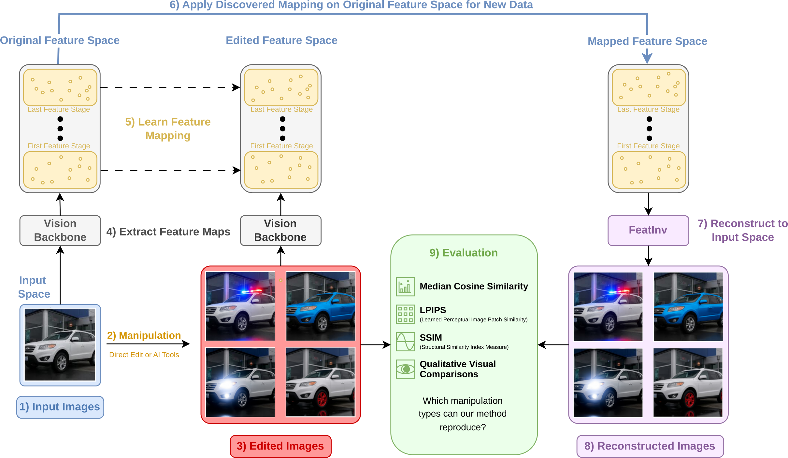

# FeatMap: Understanding image manipulation in the feature space and its implications for feature space geometry
This is the official repository for the paper: [FeatMap: Understanding image manipulation in the feature space and its implications for feature space geometry](https://arxiv.org/abs/2605.11203).

## Abstract
Intermediate feature representations represent the backbone for the expressivity and adaptability of deep neural networks. However, their geometric structure remains poorly understood. In this submission, we provide indirect insights into this matter by applying a broad selection of manipulations in input space, ranging from geometric and photometric transformations to local masking and semantic manipulations using generative image editing models, and assess the feasibility of learning a mapping in the feature space, mapping from the original to the manipulated feature map. To this end, we devise different types of mappings, from linear to non-linear and local to global mappings and assess both the reconstruction quality of the mapping as well as the semantic content of the mapped representations. We demonstrate the feasibility of learning such mappings for all considered transformations. While global (transformer) models that operate on the full feature map often achieve best results, we show that the same can be achieved with a shared linear model operating on a single feature vector typically with very little degradation in reconstruction quality, even for highly non-trivial semantic manipulations. We analyze the corresponding mappings across different feature layers and characterize them according to dominance of weight vs. bias and the effective rank of the linear transformations. These results provide hints for the hypothesis that the feature space is to a first degree of approximation organized in linear structures. From a broader perspective, the study demonstrates that generative image editing models might open the door to a deeper understanding of the feature space through input manipulation.

## Citation
If you find our work helpful, please cite our paper:
```
@misc{krey2026featmapunderstandingimagemanipulation,
      title={FeatMap: Understanding image manipulation in the feature space and its implications for feature space geometry}, 
      author={Elias B. Krey and Nils Neukirch and Nils Strodthoff},
      year={2026},
      eprint={2605.11203},
      archivePrefix={arXiv},
      primaryClass={cs.LG},
      url={https://arxiv.org/abs/2605.11203}, 
}
```

## Method overview



## Example results

 

## Getting started
All experiments were conducted on a Linux system with an NVIDIA L40 GPU.
Our pipeline consists of the following main steps:
#### images → manipulations → feature extraction → mapping → reconstruction → evaluation

### Requirements
For ease of use we utilize a Python 3.10 conda environment. Install all necessary dependencies listed in [`featmap.yaml`](featmap.yaml) and activate the conda environment. All experiments were done with these exact package versions.
```
conda env create -f featmap.yaml
conda activate featmap
```

### Preparing the dataset
We cannot directly provide our used datasets, but here are the steps to reproduce them:
  - Download the Stanford Cars dataset (16,185 images, 196 different classes), maintain the original 8,144 training images and 8,041 testing images split
  ```
  @inproceedings{KrauseStarkDengFei-Fei-3D2013,
  author    = {Jonathan Krause and Michael Stark and Jia Deng and Li Fei-Fei},
  title     = {3D Object Representations for Fine-grained Categorization},
  booktitle = {4th International IEEE Workshop on 3D Representation and Recognition (3DPR)},
  year      = {2013}
}
```
  - Download the CUB-200-2011 dataset (11,788 images)
```
@techreport{WahCUB_200_2011,
  title   = {The Caltech-UCSD Birds-200-2011 Dataset},
  author  = {Wah, C. and Branson, S. and Welinder, P. and Perona, P. and Belongie, S.},
  year    = {2011},
  institution = {California Institute of Technology},
  number  = {CNS-TR-2011-001}
}
```
  - Sort the dataset into this structure, all images need **unique** numeric ids!:

```
datasets/
├── STANFORD_CARS/
│   └── images/
│       ├── train/
│       │   ├── class_1/
│       │   ├── class_2/
│       │   └── ...
│       └── test/
│           ├── class_1/
│           ├── class_2/
│           └── ...
│
└── CUB_200_2011/
    └── images/
        ├── train/
        │   ├── class_1/
        │   ├── class_2/
        │   └── ...
        └── test/
            ├── class_1/
            ├── class_2/
            └── ...

```

Configure the manipulations you want to apply in [`config/apply_manipulations.yaml`](config/apply_manipulations.yaml). Adjust the **dataset_path** to your stored dataset. This will then create folders **augmented_train** and **augmented_test** with the same class folder structure but with the augmented images named like **ID_manipulation.png**.

**NOTE: If you want to use the Qwen Image editing model VRAM of ~57 GB is required. We used two L40 GPUs for this. Inference took ~30s per image, so configure imgs_per_class to your compute budget.**

#### Using the Qwen model requires a valid HF Token, Setup:
1. Create a token at https://huggingface.co/settings/tokens.
2. Set env var: `export HF_TOKEN='hf_xxxxxxxx'`.

```
python src/prepare_datasets/apply_manipulations.py
```

Next extract the features, configure [`config/extract_features.yaml`](config/extract_features.yaml). Adjust the **dataset_path** to your stored dataset. Select which backbone (convnext, swin), which manipulation_model_dirs (direct, qwen), and train/test/both should be extracted. This will create per backbone separate features folders in the dataset folder. 

**NOTE:** Since ConvNeXt and SwinV2 are trained for different image sizes, they are resized here before extraction.

```
python src/prepare_datasets/extract_features.py
```

**NOTE:** Extracting features for all manipulations can require a large amount of disk space (up to ~1.6 TB), due to the high dimensionality of the stored feature vectors and the number of augmented samples.

#### Feature dimensions from backbone stages

| Backbone  | Input Images        | Layer depth | Feature dimensions      |
|-----------|---------------------|-------------|--------------------------|
| ConvNeXt  | 288 × 288 × 3       | 0           | 128 × 72 × 72            |
|           |                     | 1           | 256 × 36 × 36            |
|           |                     | 2           | 512 × 18 × 18            |
|           |                     | 3           | 1024 × 9 × 9             |
| SwinV2    | 384 × 384 × 3       | 3           | 1024 × 12 × 12           |

### Train mapping models
Configure [`config/train_mapping.yaml`](config/train_mapping.yaml). Here you can set up which model should be trained with which model. Feature dimensions and manipulation names need to match to the ones created during feature extraction! Adjust all paths to where you saved your datasets and want the models and training logs to be saved.

```
python src/train_mapping.py
```

### Test mapping models
This will apply the trained mapping models to new test features, reconstruct with FeatInv and calculate evaluation metrics, configure [`config/test_mapping.yaml`](config/test_mapping.yaml). 

**Required for testing:**  
- Clone FeatInv into `src/FeatInv`  
- Download checkpoint → place in `models/`

  - This requires the correct pretrained FeatInv model checkpoints for the selected backbone and the FeatInv source code placed into this projects **src** folder.
  - All details for the use of FeatInv are explained in the [FeatInv GitHub Repository](https://github.com/AI4HealthUOL/FeatInv)
  - Place a pre-trained FeatInv model checkpoint in the **models** folder

  #### At the time of writing only the pre-trained FeatInv model weights of the model that was trained on the final ConvNeXt feature maps (in our naming feat3) is publicly available [HERE](https://figshare.com/articles/online_resource/FeatInv_FeatInv-ConvNeXt_Checkpoint/30801191/1).

```
python src/test_mapping.py
```

### Evaluating the classification performance
Optionally you can evaluate our mapping models features classification performance using a finetuned ConvNeXt or SwinV2 model. Both original Backbones are originally trained for the ImageNet-1K and need to be finetuned to the 196 Stanford Cars classes.

All finetuning is done in [ft_classifiers_cars](src/ft_classifiers_cars.py). You have the option to train only with the original Stanford Cars images or additionally all of the augmented images created with **apply_manipulations.py**. Finetuning with all augmentations is computationally expensive but proved to improve classification performance.

Once finetuned you can run image classification tests with **test_img_classifier.py** and features with **test_classifier.py**. All settings for the feature classification can be adjusted here [`config/test_classifier.yaml`](config/test_classifier.yaml). Select the correct name of the finetuned model here!

**test_classifier.py** will initially only save the class probabilities of all experiments. **eval_class_probs.py** then evaluates the probabilities and calculates all classification metrics we used in our paper.

```
python src/test_classifier.py
```

### Additional evaluations
Once linear mapping models are trained you can evaluate their weight and bias properties using [eval_lin_models_wxb](src/eval_vis/eval_lin_models_wxb.py). Again adjust [`config/eval_lin_models.yaml`](config/eval_lin_models.yaml) to the models and paths you used.

```
python src/eval_vis/eval_lin_models_wxb.py
```

For the analysis of the weight matrix properties using singular value decomposition (SVD) first run [extract_svd_linear](src/eval_vis/svd/extract_svd_linear.py), then calculate metrics with [calc_svd_metrics_linear](src/eval_vis/svd/calc_svd_metrics_linear.py).

```
python src/eval_vis/svd/calc_svd_metrics_linear.py
```

## File Structure

Core directories and their purpose:

- `models` Saved mapping models, FeatInv checkpoints, and finetuned backbones  
- `evals` Evaluation outputs and reconstructed images  
- `logs` TensorBoard training logs  
- `config` Configuration files for all scripts (named after corresponding Python files)
- `src` All source code

### `src`

#### FeatInv
Feature-to-image reconstructor from:  
https://github.com/AI4HealthUOL/FeatInv

Clone in to the src folder.

#### Dataset preparation

- `manipulations.py` Image manipulations
- `apply_manipulations.py` Applies selected transformations 
- `feature_dataset_impl.py` Feature dataset handling with metadata  
- `extract_features.py` Feature extraction

#### Mapping models

- `train_mapping.py` Trains mappings from original → manipulated features  
- `test_mapping.py` Applies mappings and evaluates reconstructions  
- `model_implementations.py` Mapping model definitions
- `eval_helpers` Loss functions etc.
- `eval_functions.py` All code for evaluating the mapped, reconstructed images against the target original and augmented images
- `utils.py` Utility functions

#### Classification

- `ft_classifier_cars.py` Finetunes both Backbones on Stanford Cars 196 classes
- `test_img_classifier.py` Classification on images  
- `test_img_classifier_recon.py` Classification on reconstructed images  
- `test_classifier.py` Classification directly on features  
