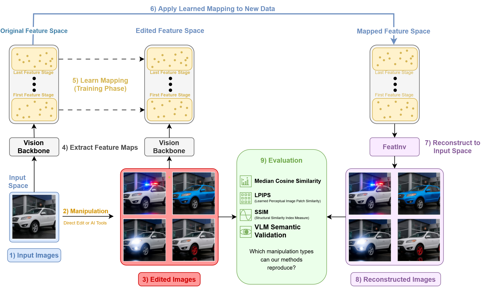
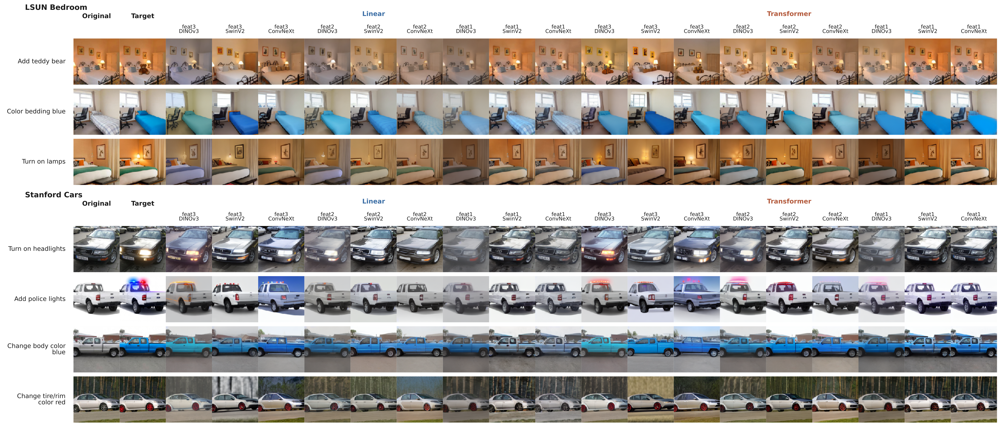

# How Far Does a Shared Linear Map Go? Probing Feature-Space Manipulability for Image Editingy
This is the official repository for the paper: **How Far Does a Shared Linear Map Go? Probing Feature-Space Manipulability for Image Editing**

## Abstract
Understanding how image-space transformations manifest in a model's internal feature representations is a longstanding goal in representation analysis. 
Prior work on model stitching and equivariance has shown that certain geometric transformations — rotations, flips — can be captured by learned linear operators between feature maps. It remains unclear whether this holds for a broader and more practically relevant class of transformations, including photometric edits and open-ended, semantically defined manipulations with no a priori linear structure in input space, such as those produced by prompted diffusion-based image editors.
We train probes with increasing capacity, ranging from a single linear map shared across all spatial locations in a feature map to nonlinear per-vector, receptive-field, and global transformer models, to predict the feature-space effects of diverse image manipulations: geometric transforms, photometric edits, local occlusions, and semantic edits (e.g., altering headlights, rim color, body color) generated via diffusion-based editing. We evaluate three vision backbones: two supervised architectures, ConvNeXt and SwinV2, and one self-supervised foundation model, DINOv3. For ConvNeXt and SwinV2, a single shared linear map, without spatial or instance-dependent conditioning, often predicts held-out manipulation outcomes with little loss relative to substantially more expressive nonlinear models. This pattern is less consistently observed for DINOv3. For the supervised backbones, the sufficiency of the shared linear map generally increases with network depth. We further show this holds despite the spatial weight-tying constraint, which is not implied by prior stitching formulations and represents a nontrivial locality claim independent of linearity. We deliberately scope our claims to representational sufficiency for held-out prediction, rather than to intrinsic properties of feature-space geometry. Our results indicate that a remarkably simple, shared linear operator is often sufficient to represent a broad class of image manipulations, with the semantic content of the edits captured by its leading k singular components and higher-rank components primarily refining image details.

## Citation
If you find our work helpful, please cite our paper:
```
@misc{krey2026featmapunderstandingimagemanipulation,
      title={FeatMap: Understanding image manipulation in the feature space and its implications for feature space geometry}, 
      author={Elias B. Krey and Nils Neukirch and Nils Strodthoff},
      year={2026},
      eprint={2605.11203},
      archivePrefix={arXiv},
      primaryClass={cs.LG},
      url={https://arxiv.org/abs/2605.11203}, 
}
```

## Method overview



## Example results

 

## Getting started
All experiments were conducted on a Linux system with an NVIDIA L40 GPU.
Our pipeline consists of the following main steps:
#### images → manipulations → feature extraction → mapping → reconstruction → evaluation

### Requirements
For ease of use we utilize a Python 3.10 conda environment. Install all necessary dependencies listed in [`featmap.yaml`](featmap.yaml) and activate the conda environment. All experiments were done with these exact package versions.
```
conda env create -f featmap.yaml
conda activate featmap
```

### Preparing the dataset
We cannot directly provide our used datasets, but here are the steps to reproduce them:
  - Download the Stanford Cars dataset (16,185 images, 196 different classes), maintain the original 8,144 training images and 8,041 testing images split
  ```
  @inproceedings{KrauseStarkDengFei-Fei-3D2013,
  author    = {Jonathan Krause and Michael Stark and Jia Deng and Li Fei-Fei},
  title     = {3D Object Representations for Fine-grained Categorization},
  booktitle = {4th International IEEE Workshop on 3D Representation and Recognition (3DPR)},
  year      = {2013}
}
```
  - Download the CUB-200-2011 dataset (11,788 images)
```
@techreport{WahCUB_200_2011,
  title   = {The Caltech-UCSD Birds-200-2011 Dataset},
  author  = {Wah, C. and Branson, S. and Welinder, P. and Perona, P. and Belongie, S.},
  year    = {2011},
  institution = {California Institute of Technology},
  number  = {CNS-TR-2011-001}
}
```
  - Download a subset of the LSUN Bedroom dataset
```
@misc{yu2016lsunconstructionlargescaleimage,
      title={LSUN: Construction of a Large-scale Image Dataset using Deep Learning with Humans in the Loop}, 
      author={Fisher Yu and Ari Seff and Yinda Zhang and Shuran Song and Thomas Funkhouser and Jianxiong Xiao},
      year={2016},
      eprint={1506.03365},
      archivePrefix={arXiv},
      primaryClass={cs.CV},
      url={https://arxiv.org/abs/1506.03365}, 
}`
```
  - Sort the dataset into this structure, all images need **unique** numeric ids!
  - The LSUN Bedroom doesnt have subclasses and images can be saved directly into the train/test folders

```
datasets/
├── STANFORD_CARS/
│   └── images/
│       ├── train/
│       │   ├── class_1/
│       │   ├── class_2/
│       │   └── ...
│       └── test/
│           ├── class_1/
│           ├── class_2/
│           └── ...
│
└── CUB_200_2011/
    └── images/
        ├── train/
        │   ├── class_1/
        │   ├── class_2/
        │   └── ...
        └── test/
            ├── class_1/
            ├── class_2/
            └── ...
```


Configure the manipulations you want to apply in [`config/apply_manipulations.yaml`](config/apply_manipulations.yaml) or [`config/apply_manipulations_lsun.yaml`](config/apply_manipulations_lsun.yaml). Adjust the **dataset_path** to your stored dataset. This will then create folders **augmented_train** and **augmented_test** with the same class folder structure but with the augmented images named like **ID_manipulation.png**.

**NOTE: If you want to use the Qwen Image editing model VRAM of ~57 GB is required. We used two L40 GPUs for this. Inference took ~30s per image, so configure imgs_per_class to your compute budget.**

#### Using the Qwen model requires a valid HF Token, Setup:
1. Create a token at https://huggingface.co/settings/tokens.
2. Set env var: `export HF_TOKEN='hf_xxxxxxxx'`.

```
python src/prepare_datasets/apply_manipulations.py
```

Next extract the features, configure [`config/extract_features.yaml`](config/extract_features.yaml). Adjust the **dataset_path** to your stored dataset. Select which backbone (convnext, swin), which manipulation_model_dirs (direct, qwen), and train/test/both should be extracted. This will create per backbone separate features folders in the dataset folder. 

**NOTE:** Since ConvNeXt and SwinV2 are trained for different image sizes, they are resized here before extraction.

```
python src/prepare_datasets/extract_features.py
```

**NOTE:** Extracting features for all manipulations can require a large amount of disk space (up to ~1.6 TB), due to the high dimensionality of the stored feature vectors and the number of augmented samples.

#### Feature dimensions for all backbones and layers. For DINOv3, feature keys `feat1--feat3` correspond to public stages 1–3 (blocks 6, 9, and final)


| Backbone  | Input Images       | Layer depth         | Feature dimensions      |
|-----------|--------------------|---------------------|-------------------------|
| ConvNeXt  | 288×288×3          | feat1               | 256×36×36               |
|           |                    | feat2               | 512×18×18               |
|           |                    | feat3               | 1024×9×9                |
| SwinV2    | 384×384×3          | feat1               | 256×48×48               |
|           |                    | feat2               | 512×24×24               |
|           |                    | feat3               | 1024×12×12              |
| DINOv3    | 224×224×3          | feat1 (Block 6)     | 768×14×14               |
|           |                    | feat2 (Block 9)     | 768×14×14               |
|           |                    | feat3 (final)       | 768×14×14               |

### Train mapping models
Configure [`config/train_mapping_cars.yaml`](config/train_mapping_cars.yaml), [`config/train_mapping_lsun.yaml`](config/train_mapping_lsun.yaml). Here you can set up which model should be trained with which model. Feature dimensions and manipulation names need to match to the ones created during feature extraction! Adjust all paths to where you saved your datasets and want the models and training logs to be saved. The `_baseline` variant implements additional mapping models.

```
python src/train_mapping_cars.py
```

### Test mapping models
This will apply the trained mapping models to new test features, reconstruct with FeatInv and calculate evaluation metrics, configure [`config/test_mapping_cars.yaml`](config/test_mapping_cars.yaml), [`config/test_mapping_lsun.yaml`](config/test_mapping_lsun.yaml). 

**Required for testing:**  
- Clone FeatInv into `src/FeatInv`  
- Download checkpoint → place in `models/`

  - This requires the correct pretrained FeatInv model checkpoints for the selected backbone and the FeatInv source code placed into this projects **src** folder.
  - All details for the use of FeatInv are explained in the [FeatInv GitHub Repository](https://github.com/AI4HealthUOL/FeatInv)
  - Place a pre-trained FeatInv model checkpoint in the **models** folder

  #### At the time of writing only the pre-trained FeatInv model weights of the model that was trained on the final ConvNeXt feature maps (in our naming feat3) is publicly available [HERE](https://figshare.com/articles/online_resource/FeatInv_FeatInv-ConvNeXt_Checkpoint/30801191/1).

```
python src/test_mapping_cars.py
```

### Evaluating the classification performance
Optionally you can evaluate our mapping models features classification performance using a finetuned ConvNeXt or SwinV2 model. Both original Backbones are originally trained for the ImageNet-1K and need to be finetuned to the 196 Stanford Cars classes.

All finetuning is done in [ft_classifiers_cars](src/ft_classifiers_cars.py). You have the option to train only with the original Stanford Cars images or additionally all of the augmented images created with **apply_manipulations.py**. Finetuning with all augmentations is computationally expensive but proved to improve classification performance.

Once finetuned you can run image classification tests with **test_img_classifier.py** and features with **test_classifier.py**. All settings for the feature classification can be adjusted here [`config/test_classifier.yaml`](config/test_classifier.yaml). Select the correct name of the finetuned model here!

**test_classifier.py** will initially only save the class probabilities of all experiments. **eval_class_probs.py** then evaluates the probabilities and calculates all classification metrics we used in our paper.

```
python src/test_classifier.py
```

### Evaluating reconstruction robustness
We added additional experiments evaluation the FeatInv reconstruction comparing mapping results against matched magnitude scaled added feature noise. To rerun this experiment  configure [`config/test_mapping_cars.yaml`](config/test_mapping_cars.yaml). And run:
```
python src/test_mapping_reconstruction_control.py
```

### Additional evaluations
Once linear mapping models are trained you can evaluate their weight and bias properties using [eval_lin_models_wxb](src/eval_vis/eval_lin_models_wxb.py). Again adjust [`config/eval_lin_models.yaml`](config/eval_lin_models.yaml) to the models and paths you used.

```
python src/eval_vis/eval_lin_models_wxb.py
```

For the analysis of the weight matrix properties using singular value decomposition (SVD) first run [extract_svd_linear](src/eval_vis/svd/extract_svd_linear.py), then calculate metrics with [calc_svd_metrics_linear](src/eval_vis/svd/calc_svd_metrics_linear.py).

```
python src/eval_vis/svd/calc_svd_metrics_linear.py
```

## File Structure

Core directories and their purpose:

- `models` Saved mapping models, FeatInv checkpoints, and finetuned backbones  
- `evals` Evaluation outputs and reconstructed images  
- `logs` TensorBoard training logs  
- `config` Configuration files for all scripts (named after corresponding Python files)
- `src` All source code

### `src`

#### FeatInv
Feature-to-image reconstructor from:  
https://github.com/AI4HealthUOL/FeatInv

Clone in to the src folder.

#### Dataset preparation

- `manipulations.py` Image manipulations
- `apply_manipulations.py` Applies selected transformations 
- `feature_dataset_impl.py` Feature dataset handling with metadata  
- `extract_features.py` Feature extraction

#### Mapping models

- `train_mapping.py` Trains mappings from original → manipulated features  
- `test_mapping.py` Applies mappings and evaluates reconstructions  
- `model_implementations.py` Mapping model definitions
- `eval_helpers` Loss functions etc.
- `eval_functions.py` All code for evaluating the mapped, reconstructed images against the target original and augmented images
- `utils.py` Utility functions

#### Classification

- `ft_classifier_cars.py` Finetunes both Backbones on Stanford Cars 196 classes
- `test_img_classifier.py` Classification on images  
- `test_img_classifier_recon.py` Classification on reconstructed images  
- `test_classifier.py` Classification directly on features  
